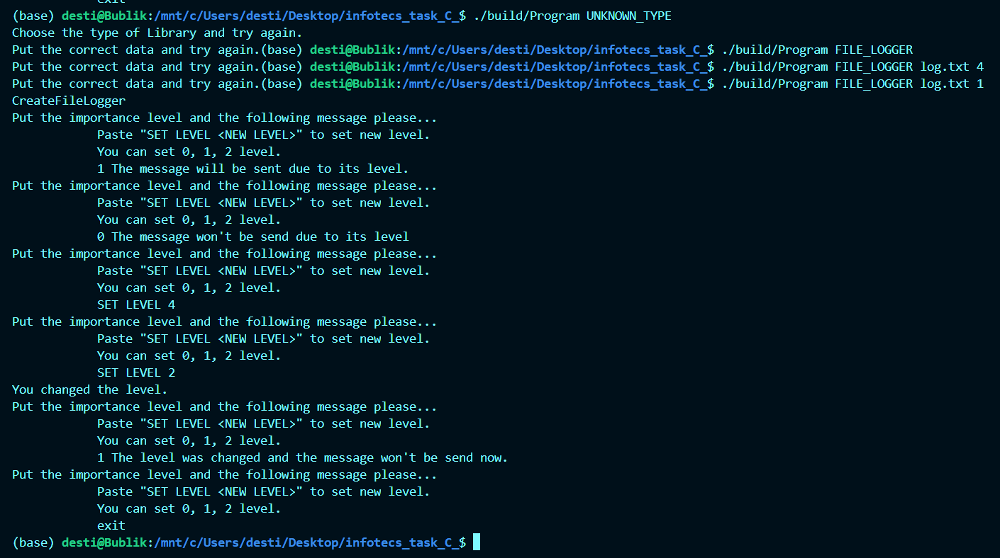
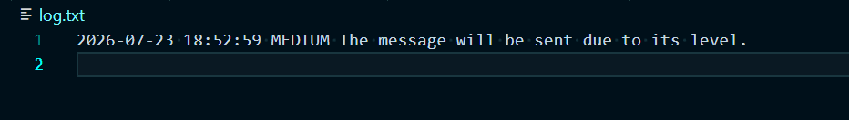
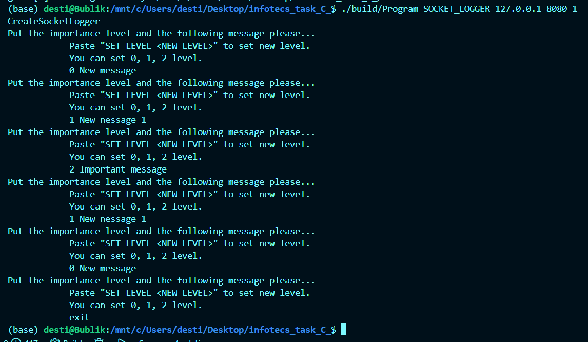
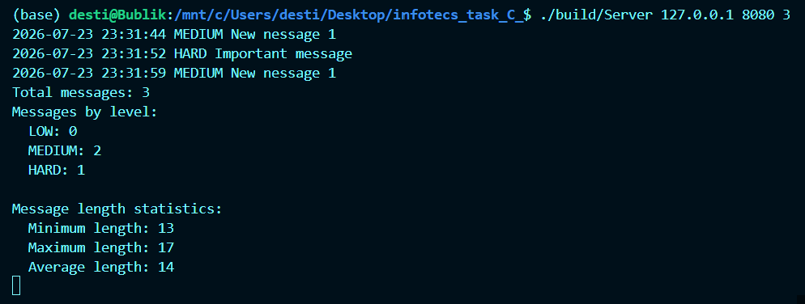

# Библиотека для записи сообщений в журнал с разными уровнями важности.

Этот проект представляет собой библиотеку для записи сообщений в журнал с разными уровнями важности и приложение,
демонстрирующее работу библиотеки. 

## Структура проекта

-   `/include/Library/Library.h`: Заголовочный файл библиотеки.
-   `/include/ThreadClasses/ThreadClasses.h`: Заголовочный файл реализации потокобезопасной очереди и функций обработки запросов.
-   `/include/Program/Program.h`: Заголовочный файл приложения.
-   `src/`: Файлы реализации двух версий библиотеки (с использованием сокетов и без).
-   `ThreadClasses/ThreadClasses.cpp`: Реализация потокобезопасной очереди и функций обработки запросов.
-   `Program/Program.cpp`: Реализация приложения.
-   `Makefile`: Makefile с целями: all, install, uninstall, clean, tests, dvi, dist.
-   `main.cpp`: Запуск программы.
-   `Doxyfile`: Сборка документации.
-   `images`: Изображения для README.
-   `README.md`: Описание проекта.

## Установка

1.  Клонируйте репозиторий:
    ```bash
    git clone https://github.com/TarasovaAlina/infotecs_task_C_.git
    ```
2.  Установите необходимые библиотеки:
    ```bash
    sudo apt install cpp g++ gcc build-essential cmake
    ```

## Сборка проекта

Скопировать код из репозитория
```bash
git clone  https://github.com/TarasovaAlina/infotecs_task_C_.git
```

Чтобы установить программу, необходимо ввести команду:
```bash
make install
```

Сборка статической библиотеки:
```bash
make static_library
```

Сборка динамической библиотеки:
```bash
make dynamic_library
```

Если необходимо удалить программу, то
```bash
make uninstall
```

Если необходимо запустить тесты, то
```bash
make test
```

Если необходимо проверить покрытие тестами, то
```bash
make gcov_report
```

Если необходимо создать архив, то
```bash
make dist
```

Если необходимо создать отчет, то
```bash
make dvi
```

Если необходимо очистить директорию, то
```bash
make clean
```

## Использование

Чтобы запустить программу, выберите тип библиотеки.

### Библиотека для работы с текстовым файлом

Для библиотеки с текстовым файлом введите тип библиотеки  `FILE_LOGGER`, имя текстового файла и уровень важности сообщения по умолчанию.
Всего 3 уровня важности: 0(LOW), 1(MEDIUM), 2(HARD).

Пример запуска:
```bash
./build/Program FILE_LOGGER log.txt 1
```

Далее вы можете или изменить уровень по умолчанию командой `SET LEVEL <LEVEL NUMBER>` или занести лог в журнал. Сообщение принимается с уровнем важности. 
Если уровень важности не был указан, устанавливается уровень по умолчанию.
Чтобы завершить программу, введите `exit`.

Пример использования приложения:

- Запуск приложения, ввод сообщений и выход.




- Содержимое созданного текстового файла log.txt.



### Библиотека для работы с сокетом

Для библиотеки с сокетом введите тип библиотеки  `SOCKET_LOGGER`, номер хоста, номер порта и уровень важности сообщения по умолчанию.
Всего 3 уровня важности: 0(LOW), 1(MEDIUM), 2(HARD).
Чтобы завершить программу, введите `exit`.
Для сервера введите номер хоста, номер порта и количество сообщений, после которых появится вывод статистике в консоли.

Пример запуска клиента:
```bash
./build/Program SOCKET_LOGGER 127.0.0.1 8080 1
```

Пример запуска сервера:
```bash
./build/Server 127.0.0.1 8080 3
```

Пример использования приложения:

- Запуск приложения, ввод сообщений и выход.



- Вывод в терминал сервера с примером статистики.




